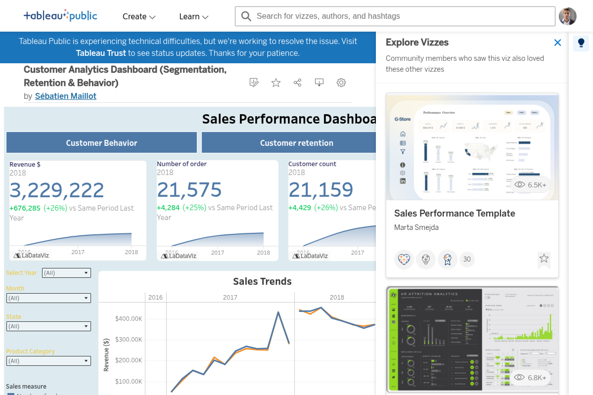
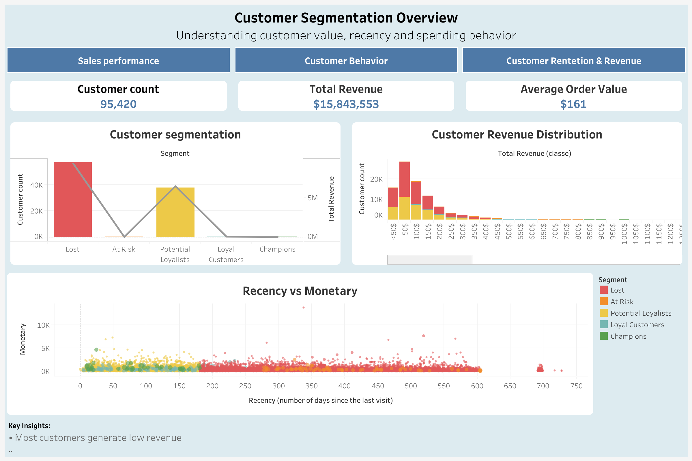
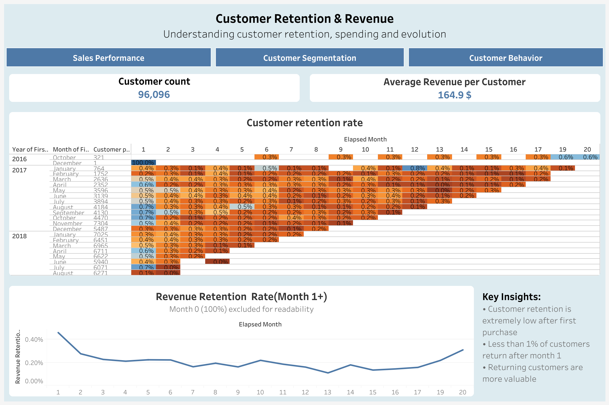
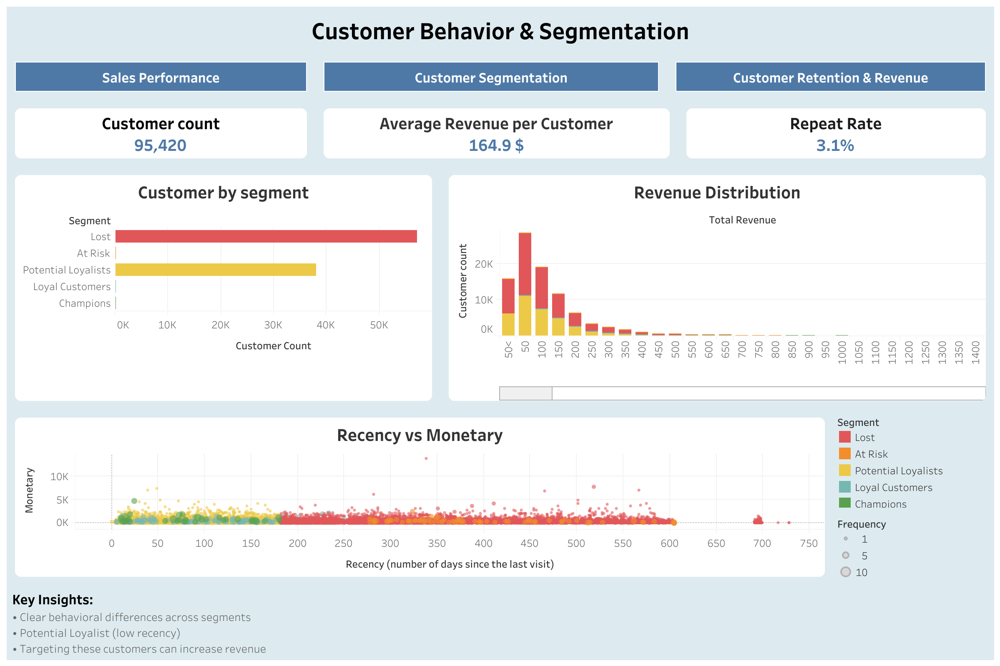

#  CUSTOMER ANALYTICS & PERFORMANCE DASHBOARD

## 🚀 Project Overview

This project analyzes customer behavior using segmentation, cohort retention, and revenue analysis.

The goal is to identify the company's performance, high-value customers, understand churn patterns, and support data-driven decision making.

---

## 🔍 Key Insights

- Customer retention drops significantly after the first purchase
- A small percentage of customers generates most of the revenue
- High-value customers show distinct behavioral patterns
- Repeat purchase rate is low, indicating a transactional business model

---

## 📊 Dashboards

### 1. Sales perfomance

### 2. Customer Segmentation

### 3. Customer Retention & Revenue

### 4. Customer Behavior

---

## 🛠 Tools Used

- Tableau (Data Visualization)
- Python (Data Cleaning & Feature Engineering)
- Pandas

---

## 🌐 Live Dashboard

👉 [View on Tableau Public](https://public.tableau.com/views/BIanalytic/Dashboard4?:language=en-US&:sid=&:redirect=auth&:display_count=n&:origin=viz_share_link)

---

## 📂 Dataset

Dataset inspired by real-world Brazilian e-commerce transactions.
👉[Public Dataset by Olist from Kaggle](https://www.kaggle.com/datasets/olistbr/brazilian-ecommerce?resource=download)

---

## 👤 Author

Sébastien Maillot
